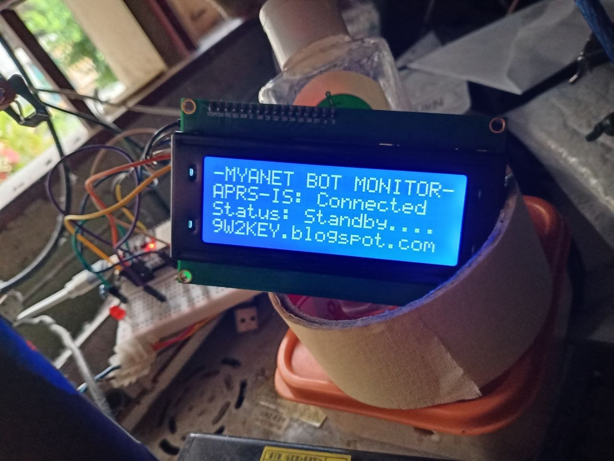
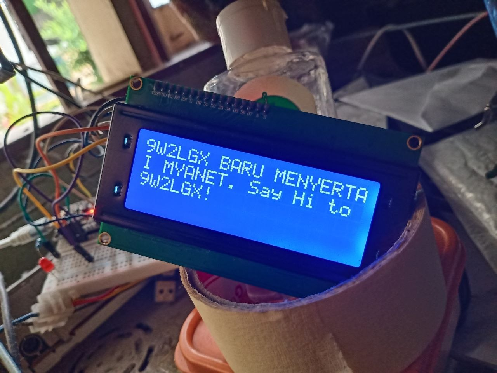
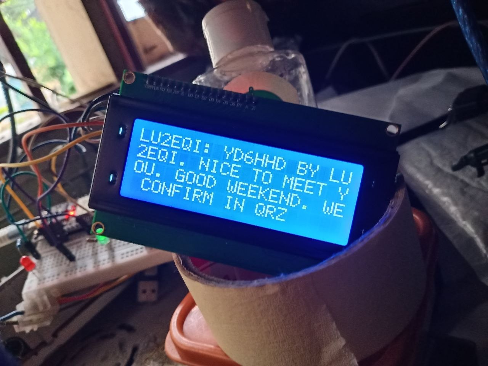
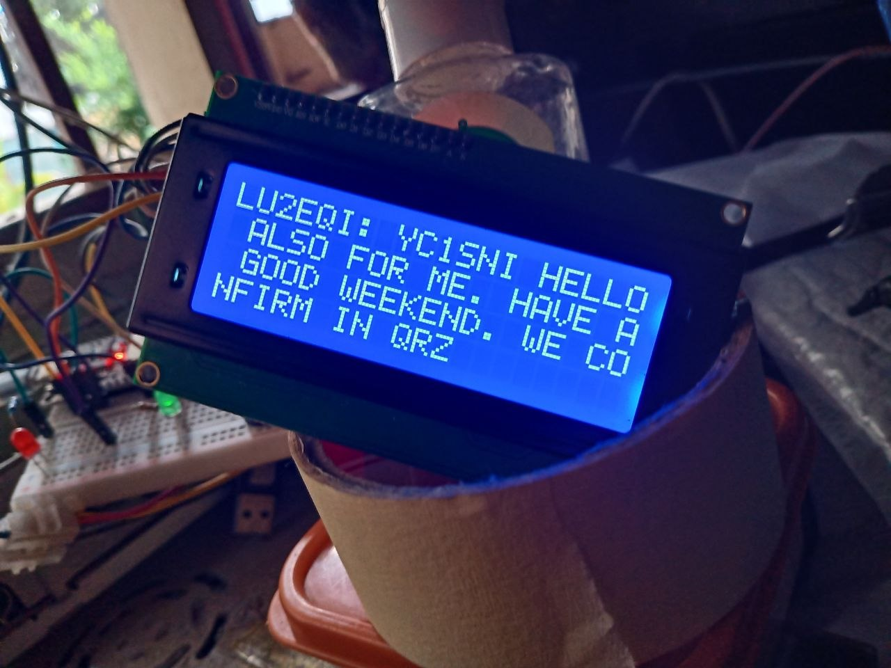
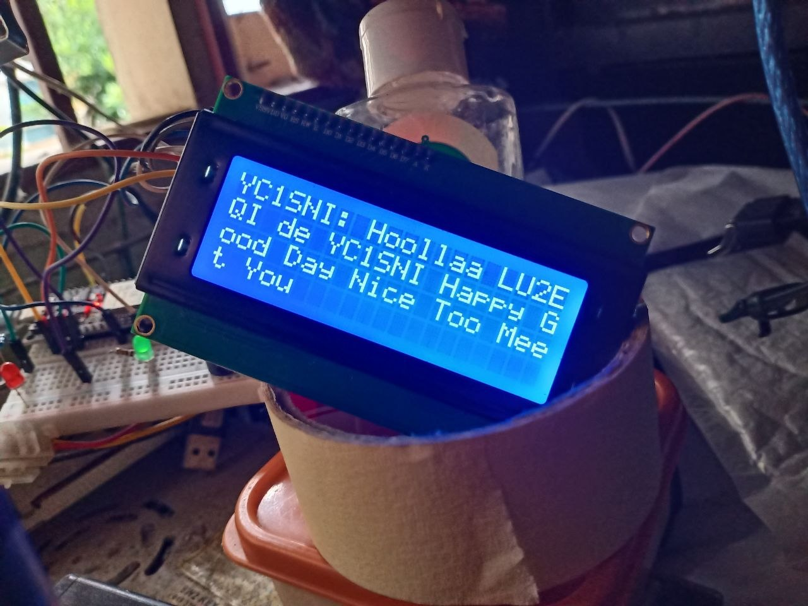
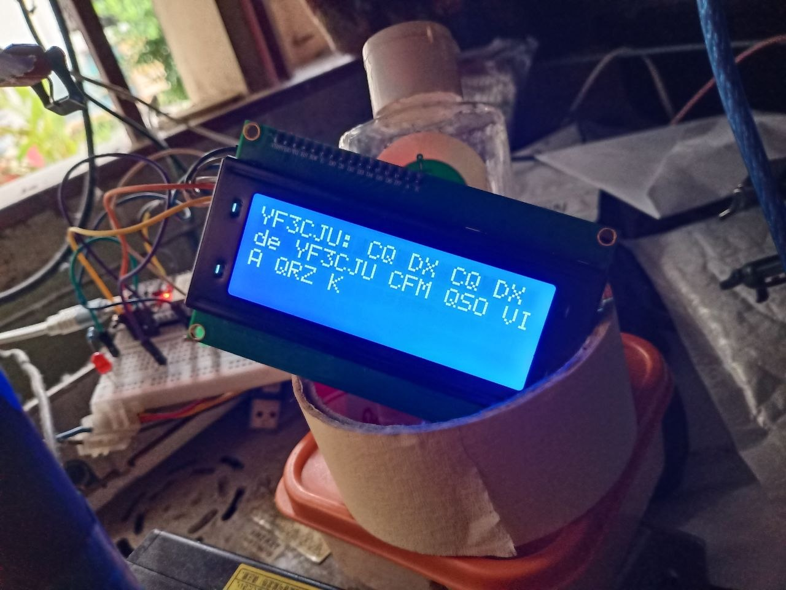

# MYANET_MONITOR
Monitor all activity of MYANET APRS Bot via LCD, for Ham Radio user or MYANET clients. No ham radio license need, monitoring only (RX only).

What you need:
1. LCD 20x4
2. ESP32
3. Resistor x 2
4. LED x 2
5. Buzzer x 1

## Project Photos

